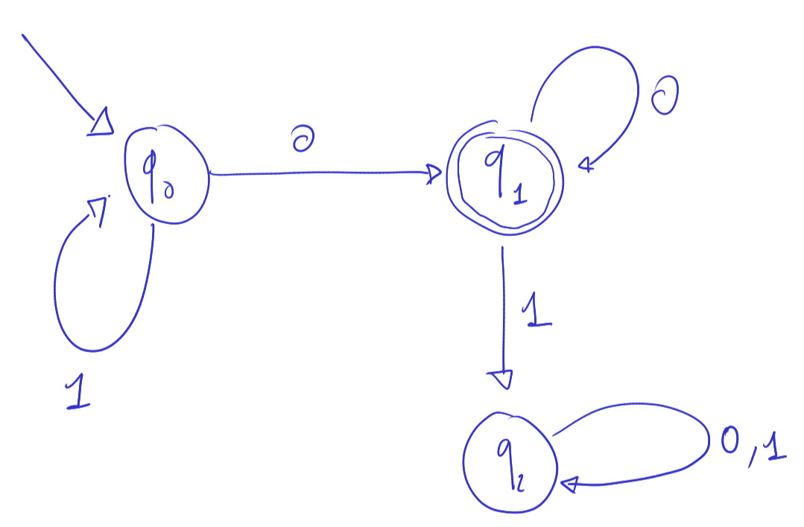

# Simple Automata

> Implementazione di un automa che riconosce il linguaggio delle stringhe che iniziano (opzionalmente) con 1 e finiscono con almeno uno zero in TypeScript.

## Automa

### Grafo



### Definizione

- Stati _Q = { q0, q1, q2 }_
- Alfabeto _Sigma = { 0, 1 }_
- Stato iniziale _q0_
- Insime degli stati accettato _F = { q1 }_
- Funzione di transizione _d_ (tabelld di seguito)

| d   | 0   | 1   |
| --- | --- | --- |
| q0  | q1  | q0  |
| q1  | q1  | q2  |
| q2  | q2  | q2  |

### Esempi

| Stringa            | Accettata |
| ------------------ | --------- |
| `` (stringa vuota) | ❌        |
| `0`                | ✅        |
| `000000`           | ✅        |
| `10`               | ✅        |
| `100000`           | ✅        |
| `11100000000`      | ✅        |
| `1`                | ❌        |
| `111100001`        | ❌        |
| `010101`           | ❌        |

Legenda:

- ✅ = accettata
- ❌ = rifiutata

`11100000`

## Codice

### Installazione

Scarica il codice oppure, se hai installato e configurato Git, esegui il comando

```
git clone git@github.com:lparolari/simple-automata.git
cd simple-automata
```

### Utilizzo

- Esegui il "main"

```
yarn ts-node index.ts
```

- Utilizza le funzioni esposte da `automata.ts`

```typescript
import { is_accettata } from "/path/to/automata";

console.log(is_accettata([1, 1, 0, 0])); // true
console.log(is_accettata([1, 1, 0, 1])); // false
```

### Test

Esegui i test tramite

```
yarn test
```

## Autore

**Luca Parolari**

- Email: [luca.parolari23@gmail.com](mailto:luca.parolari23@gmail.com)
- GitHub: [@lparolari](https://github.com/lparolari)
- Telegram: [@lparolari](https://t.me/lparolari)

## Licenza

MIT
